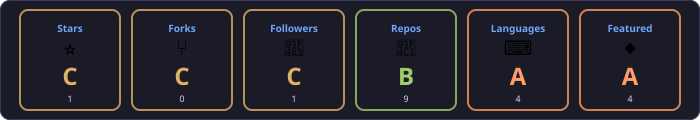
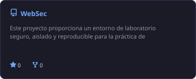
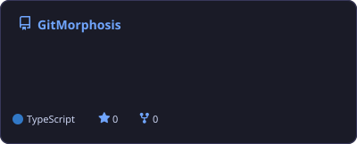

<div align="center">

<picture>
  <source media="(max-width: 480px) and (prefers-color-scheme: dark)" srcset="assets/header-mobile-dark.svg">
  <source media="(max-width: 480px) and (prefers-color-scheme: light)" srcset="assets/header-mobile-light.svg">
  <source media="(prefers-color-scheme: dark)" srcset="assets/header-dark.svg">
  <source media="(prefers-color-scheme: light)" srcset="assets/header-light.svg">
  
</picture>

<picture>
  <source media="(max-width: 480px) and (prefers-color-scheme: dark)" srcset="assets/stack-mobile-dark.svg">
  <source media="(max-width: 480px) and (prefers-color-scheme: light)" srcset="assets/stack-mobile-light.svg">
  <source media="(prefers-color-scheme: dark)" srcset="assets/stack-dark.svg">
  <source media="(prefers-color-scheme: light)" srcset="assets/stack-light.svg">
  
</picture>

</div>

## 💫 About me

```javascript
const developer = {
  name: "Carlos-Coronel",
  languages: ["JavaScript","TypeScript","Python","PHP"],
  followers: 1,
  publicRepos: 9
};
```

## 🏆 GitHub trophies

<div align="center">

<picture>
  <source media="(max-width: 480px) and (prefers-color-scheme: dark)" srcset="assets/trophies-mobile-dark.svg">
  <source media="(max-width: 480px) and (prefers-color-scheme: light)" srcset="assets/trophies-mobile-light.svg">
  <source media="(prefers-color-scheme: dark)" srcset="assets/trophies-dark.svg">
  <source media="(prefers-color-scheme: light)" srcset="assets/trophies-light.svg">
  
</picture>

</div>

## 📊 GitHub stats

<div align="center">

<picture>
  <source media="(max-width: 480px) and (prefers-color-scheme: dark)" srcset="assets/stats-mobile-dark.svg">
  <source media="(max-width: 480px) and (prefers-color-scheme: light)" srcset="assets/stats-mobile-light.svg">
  <source media="(prefers-color-scheme: dark)" srcset="assets/stats-dark.svg">
  <source media="(prefers-color-scheme: light)" srcset="assets/stats-light.svg">
  
</picture>

</div>

## 🌟 Featured repositories

<a href="https://github.com/Carlos-Coronel/TaskClase">
<picture>
  <source media="(max-width: 480px) and (prefers-color-scheme: dark)" srcset="assets/project-1-mobile-dark.svg">
  <source media="(max-width: 480px) and (prefers-color-scheme: light)" srcset="assets/project-1-mobile-light.svg">
  <source media="(prefers-color-scheme: dark)" srcset="assets/project-1-dark.svg">
  <source media="(prefers-color-scheme: light)" srcset="assets/project-1-light.svg">
  
</picture>
</a>

<a href="https://github.com/Carlos-Coronel/WebSec">
<picture>
  <source media="(max-width: 480px) and (prefers-color-scheme: dark)" srcset="assets/project-2-mobile-dark.svg">
  <source media="(max-width: 480px) and (prefers-color-scheme: light)" srcset="assets/project-2-mobile-light.svg">
  <source media="(prefers-color-scheme: dark)" srcset="assets/project-2-dark.svg">
  <source media="(prefers-color-scheme: light)" srcset="assets/project-2-light.svg">
  
</picture>
</a>

<a href="https://github.com/Carlos-Coronel/Carlos-Coronel">
<picture>
  <source media="(max-width: 480px) and (prefers-color-scheme: dark)" srcset="assets/project-3-mobile-dark.svg">
  <source media="(max-width: 480px) and (prefers-color-scheme: light)" srcset="assets/project-3-mobile-light.svg">
  <source media="(prefers-color-scheme: dark)" srcset="assets/project-3-dark.svg">
  <source media="(prefers-color-scheme: light)" srcset="assets/project-3-light.svg">
  
</picture>
</a>

<a href="https://github.com/Carlos-Coronel/GitMorphosis">
<picture>
  <source media="(max-width: 480px) and (prefers-color-scheme: dark)" srcset="assets/project-4-mobile-dark.svg">
  <source media="(max-width: 480px) and (prefers-color-scheme: light)" srcset="assets/project-4-mobile-light.svg">
  <source media="(prefers-color-scheme: dark)" srcset="assets/project-4-dark.svg">
  <source media="(prefers-color-scheme: light)" srcset="assets/project-4-light.svg">
  
</picture>
</a>

## 🌐 Connect

[GitHub](https://github.com/Carlos-Coronel)

<div align="center">

<picture>
  <source media="(max-width: 480px) and (prefers-color-scheme: dark)" srcset="assets/footer-mobile-dark.svg">
  <source media="(max-width: 480px) and (prefers-color-scheme: light)" srcset="assets/footer-mobile-light.svg">
  <source media="(prefers-color-scheme: dark)" srcset="assets/footer-dark.svg">
  <source media="(prefers-color-scheme: light)" srcset="assets/footer-light.svg">
  
</picture>

</div>
