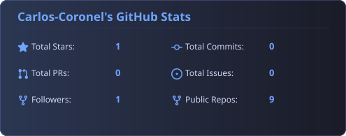
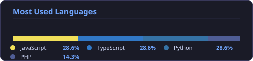

```text
$ whoami
Carlos-Coronel

$ cat profile.txt
Developer
Public repos: 9
Followers: 1

$ ls skills/
JavaScript      ███░░░░░░░ 28.6%
TypeScript      ███░░░░░░░ 28.6%
Python          ███░░░░░░░ 28.6%
PHP             ██░░░░░░░░ 14.3%
```

## System metrics

<picture>
  <source media="(max-width: 480px) and (prefers-color-scheme: dark)" srcset="assets/stats-mobile-dark.svg">
  <source media="(max-width: 480px) and (prefers-color-scheme: light)" srcset="assets/stats-mobile-light.svg">
  <source media="(prefers-color-scheme: dark)" srcset="assets/stats-dark.svg">
  <source media="(prefers-color-scheme: light)" srcset="assets/stats-light.svg">
  
</picture>

<picture>
  <source media="(max-width: 480px) and (prefers-color-scheme: dark)" srcset="assets/languages-mobile-dark.svg">
  <source media="(max-width: 480px) and (prefers-color-scheme: light)" srcset="assets/languages-mobile-light.svg">
  <source media="(prefers-color-scheme: dark)" srcset="assets/languages-dark.svg">
  <source media="(prefers-color-scheme: light)" srcset="assets/languages-light.svg">
  
</picture>

## Repositories

### [TaskClase](https://github.com/Carlos-Coronel/TaskClase)
Proyecto destacado

⭐ 1 · 🍴 0 · JavaScript

### [WebSec](https://github.com/Carlos-Coronel/WebSec)
Este proyecto proporciona un entorno de laboratorio seguro, aislado y reproducible para la práctica de auditoría web y vulnerabilidades del OWASP Top 10

⭐ 0 · 🍴 0

### [Carlos-Coronel](https://github.com/Carlos-Coronel/Carlos-Coronel)
Proyecto destacado

⭐ 0 · 🍴 0

### [GitMorphosis](https://github.com/Carlos-Coronel/GitMorphosis)
Proyecto destacado

⭐ 0 · 🍴 0 · TypeScript

```text
$ echo "Thanks for visiting!"
```

## Links

[GitHub](https://github.com/Carlos-Coronel)
